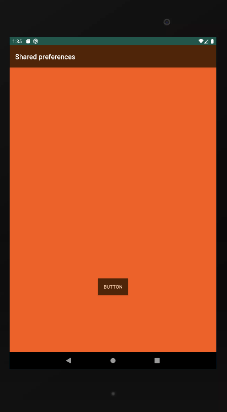
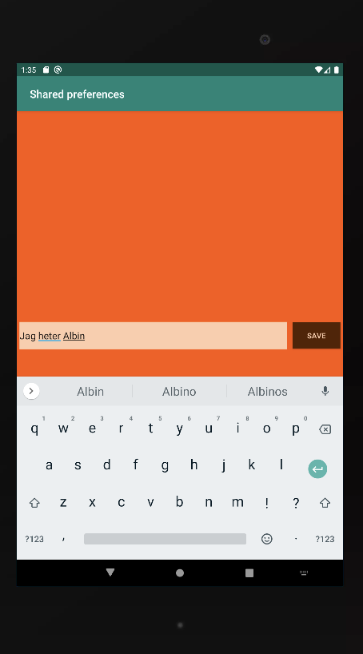
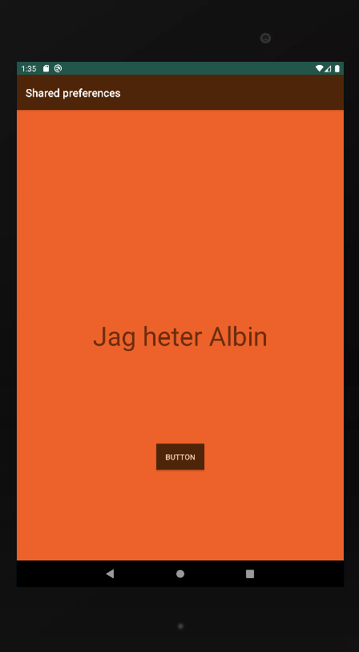

# Rapport

En variabel med SharedPreferences och dess editor skapas i MainActivity. 
I onCreate metoden skapas referenser till SharedPreferens och dess editor. En referens till
textelementet som ska skriva ut texten skapas genom findViewById och texten på elementet sätts
till värdet på MyAppPreferenceString som ligger i sharedpreferenses. Samma sak händer i onResume
metoden.

        // Get a reference to the shared preference
        myPreferenceRef = getSharedPreferences("MyPreferenceName", MODE_PRIVATE);
        myPreferenceEditor = myPreferenceRef.edit();

        // Display preferences
        TextView prefTextRef=new TextView(this);
        prefTextRef=(TextView)findViewById(R.id.prefText);
        prefTextRef.setText(myPreferenceRef.getString("MyAppPreferenceString", "No preference found."));

En andra screen skapas där användaren kan ändra strängen i shared preferenses. En knapp skapas
på main skärmen som för över användare till skärm 2 då man klickar.

        Button button = findViewById(R.id.button);
        final Intent intent = new Intent(MainActivity.this, SecondActivity.class);

        button.setOnClickListener(new View.OnClickListener(){
            @Override
            public void onClick(View view) {
                startActivity(intent);
            }
        });

I second activity klassen skapas på samma sätt som i main referenser till SharedPreferences i 
onCreate metoden. Sedan finns en metod som körs då användaren trycker sparaknappen i sin view.
Denna metod hämtar texten i editText elementet och sätter MyAppPreferenceString till samma värde.
Värdet sparas och värdet i editText sätts till ett tomt värde.

        EditText newPrefText=new EditText(this);
        newPrefText=(EditText)findViewById(R.id.settingseditview);

        // Store the new preference
        myPreferenceEditor.putString("MyAppPreferenceString", newPrefText.getText().toString());
        myPreferenceEditor.apply();

        // Clear the EditText
        newPrefText.setText("");

Slutresultatet:

Sida 1:

Sida 2:

Åter till sida 1:

